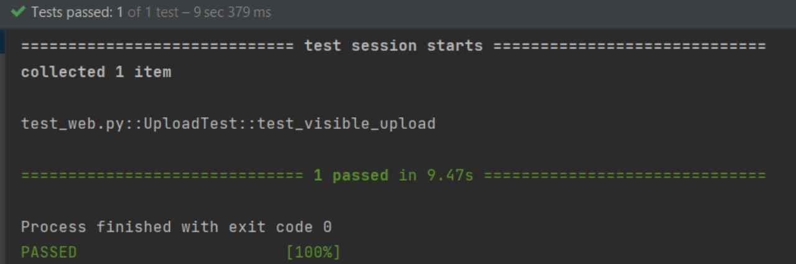
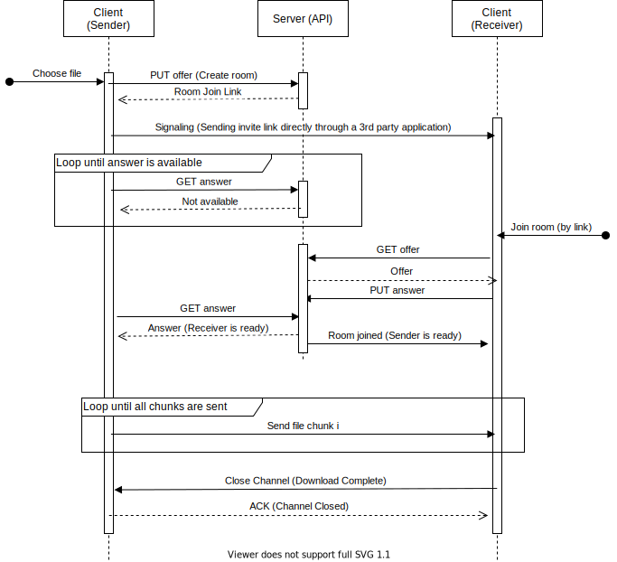

# Pipe File Transfer (PFT)
PFT is a Web Application for simultaneous upload/download of files between two users. It uses [WebRTC](https://webrtc.org/) as the underlying protocol.

# Table of Contents
- [Features](https://github.com/Sh3B0/pft#Features)
- [How the web-application works](https://github.com/Sh3B0/pft#How-the-web-application-works)
- [Frameworks and technology used](https://github.com/Sh3B0/pft#Frameworks-and-technology-used)
- [Local testing](https://github.com/Sh3B0/pft#Local-testing)
- [UI Test](https://github.com/Sh3B0/pft#UI-Test)
- [Known issues](https://github.com/Sh3B0/pft#known-issues)
- [Rational Unified Process (RUP)](https://github.com/Sh3B0/pft#Rational-Unified-Process-RUP)
- [Sequence Diagram](https://github.com/Sh3B0/pft#Sequence-Diagram)
- [Contribution](https://github.com/Sh3B0/pft#Contribution)
- [Acknowledgment](https://github.com/Sh3B0/pft#Acknowledgment)
- [Credits](https://github.com/Sh3B0/pft#Credits)
- [License](https://github.com/Sh3B0/pft#License)

## Features
* Generating a shareable link
* Establish the connection between users using that link
* Ability to share the link on social media with one click away
* Uploading the file(s)
* Downloading the file(s)
* Hosted website with good user interface for interaction

## How the web-application works

### 1. Sending files screen.
The first page that a user sees is the page for sending files. A user will generate a link and send it to his/her peer. After they are connected, then they can share files simultaneously.

### 2. Receiving files screen. 
When a user wants to receive a file, they should be on the "Receive" page. After the link is generated and shared, the new peer who wants to connect pastes it in the designated input field to get connected. After the connection is successful, then they can share files simultaneously.

### 3. About us screen.
Information about the team of developers behind this amazing tool is detailed here.  
Feel free to check and contact us!

## Frameworks and technology used
- Python flask for backend, REST API.  
- Heroku for hosting.
- Gunicorn WSGI server.
- HTML, CSS, Vanilla JS for front-end and client-side code.
- [WebRTC](https://webrtc.org/) has to be supported by the use browser

## Local testing

1. Install requirements `pip install -r requirements.txt`
2. run `python3 server.py`

## UI Test

UI Test is available in dev branch. This test opens a new window the provided URL (for now it is local), selects a file, 
copies the room id, then it opens receiver window, 
pastes the code and downloads the file. 
Finally, it checks whether the file was received correctly.
For now, it is working only locally. You can download dev branch and execute test_web.py. 
Below there is a screenshot of UI test result.

## Known issues
- `Unchecked runtime.lastError: The message port closed before a response was received.`
  - Most probably this is because of a browser extension intervening in connection establishment.

- `ICE failed, add a TURN server and see about:webrtc for more details`
  - Either you are behind a firewall or a symmetric NAT that won't allow WebRTC to work.

## Rational Unified Process (RUP)
Artifact document can be accessed from [here](https://docs.google.com/document/d/1GqM4aWmn1mIMESfchbyP4V_1bdpMjHSS/edit?usp=sharing&ouid=115455970424621213111&rtpof=true&sd=true)

## Sequence Diagram

## Contribution
Feel free to open a pull request, suggest a feature, or report a bug by creating an issue  

## Acknowledgment
The project is made as a part of Software Systems Analysis and Design Course (S21) at Innopolis University.  

## Credits
Students:
- Ahmed Nouralla
- Talgat Bektleuov
- Nikita Poryvaev
- Igor Mpore

## License
The source code for the site is licensed under the MIT license, which you can find in the LICENSE file.   
