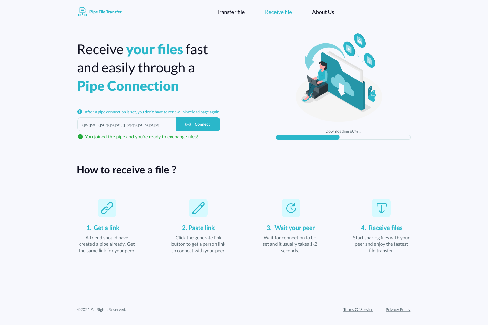

# Pipe File Transfer (PFT)
PFT is a Web Application for simultaneous upload/download of files between users. It uses WebRTC as the underlying protocol.  
The project is made as a part of Software Systems Analysis and Design Course (S21) at Innopolis University.  

# Table of Contents
- [Rational Unified Process (RUP)](https://github.com/Sh3B0/pft#Rational%20Unified%20Process%20(RUP))
- [Sequence Diagram](https://github.com/Sh3B0/pft#Sequence%20Diagram)
- [Features](https://github.com/Sh3B0/pft#Features)
- [Screenshots](https://github.com/Sh3B0/pft#Screenshots)
- [Frameworks and technology used](https://github.com/Sh3B0/pft#Frameworks%20and%20technology%20used)
- [Contribution](https://github.com/Sh3B0/pft#Contribution)
- [Credits](https://github.com/Sh3B0/pft#Credits)
- [License](https://github.com/Sh3B0/pft#License)

## Rational Unified Process (RUP)
Artifact document can be accessed from [here](https://docs.google.com/document/d/1GqM4aWmn1mIMESfchbyP4V_1bdpMjHSS/edit?usp=sharing&ouid=115455970424621213111&rtpof=true&sd=true)

## Sequence Diagram

## Features
* Generating a shareable link
* Establish the connection between users using that link
* Ability to share the link on social media with one click away
* Uploading the file(s)
* Downloading the file(s)
* Hosted website with good user interface for interaction

## Screenshots 

### 1. Sending files screen.
The first page that a user sees is the page for sending files. A user will generate a link and send it to his/her peer. After they are connected, then they can share files simultaneously.

### 2. Receiving files screen. 
When a user wants to receive a file, they should be on the "Receive" page. After the link is generated and shared, the new peer who wants to connect pastes it in the designated input field to get connected. After the connection is successful, then they can share files simultaneously.

### 3. About us screen.
Information about the team of developers behind this amazing tool is detailed here.  
Feel free to check stalk them :)

## Frameworks and technology used
- Flask for backend  
- HTML, CSS, Vanilla JS for front-end and client-side  
- WebRTC has to be supported by the user browser

## Contribution
- Feel free to open a pull request, suggest a feature, or report a bug by creating an issue   

## Credits
- Ahmed Nouralla
- Talgat Bektleuov
- Nikita Poryvaev
- Igor Mpore

## License
The source code for the site is licensed under the MIT license, which you can find in the LICENSE file.   

